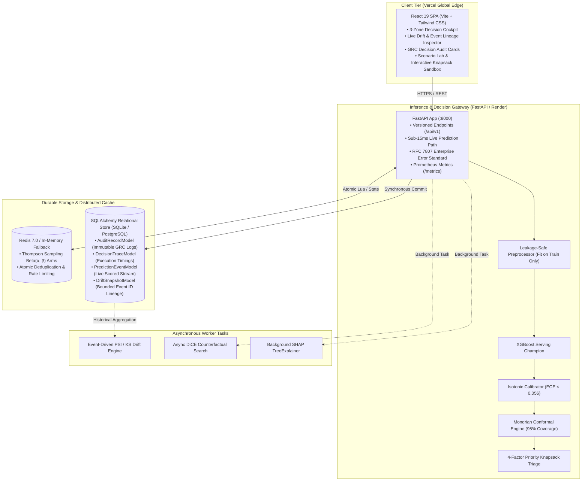

# ⚡ RetentionAI — Decision Intelligence Platform for Budget-Constrained Customer Retention

<div align="center">

[](https://retentionai-olive.vercel.app)
[](https://retentionai-api.onrender.com/docs)
[](LICENSE)

[](https://www.python.org)
[](https://fastapi.tiangolo.com)
[](https://react.dev)
[](https://vitejs.dev)
[](https://tailwindcss.com)
[](https://www.sqlalchemy.org)
[](https://xgboost.readthedocs.io)
[](#-mondrian-conformal-prediction)
[](#-thompson-sampling-bandit-policy)
[](https://redis.io)

**A decision intelligence and customer triage platform designed for real-world budget constraints.**  
*Moving beyond raw churn prediction to calibrated risk, mathematical uncertainty quantification, economic triage, durable audit trails, and live output drift monitoring.*

</div>

---

## 🎯 The Core Product Vision

Most churn prediction projects collapse because they treat machine learning as an isolated classification task with arbitrary $0.5$ probability thresholds.

**RetentionAI answers the four fundamental questions required by enterprise retention teams:**

1. **Who should we investigate?**  
   *Rank-ordered by calibrated risk, monthly revenue value, exit sensitivity, and contactability under strict call budget limits.*
2. **Why is this customer being prioritized?**  
   *Explainable feature-level attribution, local SHAP drivers, and actionable counterfactual levers.*
3. **What should the retention team do?**  
   *Operational action routing (Diagnostic Review Call, Senior Specialist, Automated Discount, Standard Control) with decision confidence.*
4. **Can we trust this recommendation?**  
   *Dataset lineage, disjoint calibration protocols, Mondrian conformal coverage guarantees, durable execution traces, and paired PSI/KS drift monitoring.*

---

## 🔄 The Closed Decision Intelligence Loop

RetentionAI operates as a continuous, closed-loop decision system where predictions are calibrated, bounded by uncertainty, prioritized by budget, audited, and continuously monitored:

```
┌────────────────────────────────────────────────────────────────────────────────────────────────────────┐
│                                  THE CLOSED DECISION INTELLIGENCE LOOP                                 │
├───────────────────┬───────────────────┬────────────────────────┬───────────────────┬───────────────────┤
│   01  PREDICT     │   02  CALIBRATE   │03 QUANTIFY UNCERTAINTY │  04  PRIORITIZE   │      05  ACT      │
│   XGBoost churn   │Isotonic probablty │   Mondrian conformal   │ Budget-constrain'd│ Recommended next  │
│    propensity     │    calibration    │       prediction       │  economic ranking │    action step    │
├───────────────────┼───────────────────┼────────────────────────┴───────────────────┴───────────────────┤
│   06  FEEDBACK    │    07  AUDIT      │                          08  MONITOR                           │
│ Thompson Sampling │ Durable decision  │             PSI + KS output drift + event lineage              │
│ + outcome updates │+ execution trace  │                  (#start_id → #end_id bounds)                  │
├───────────────────┴───────────────────┴────────────────────────────────────────────────────────────────┤
│  ↺ Continuous Closed Loop: Live drift telemetry & outcome feedback inform the next prediction cycle ──┘│
└────────────────────────────────────────────────────────────────────────────────────────────────────────┘
```

---

## 🏛️ System Architecture



---

## 🔬 Scientific Rigor & Statistical Guarantees

### 1. Strict 4-Way Disjoint Partitioning (No Exchangeability Breakdown)
Standard student projects fit calibrators on training data or evaluate conformal thresholds on calibration sets, breaking the exchangeability assumption required for valid coverage. RetentionAI enforces a **strict 4-way disjoint split** ([`ADR-010`](docs/decisions/ADR-010-stage9-calibration-conformal.md), [`ADR-017`](docs/decisions/ADR-017-production-hardening-and-portfolio-audit.md)):

```
Total Dataset: 7,043 rows (100.0%)
 ├── 1. Train Split:       5,634 rows (80.0%) ──> Fits WoE/IV Encoders, Scalers, and XGBoost Trees
 ├── 2. Calibration Split:   470 rows (6.7%)  ──> Fits Isotonic Regressor (Frozen, untouched by XGBoost)
 ├── 3. Conformal Split:     470 rows (6.7%)  ──> Computes Mondrian nonconformity quantiles
 └── 4. Holdout Split:       469 rows (6.6%)  ──> Pure untouched benchmark release verification
```

### 2. Valid Mondrian Conformal Prediction Sets
- Computes nonconformity scores $s_i = 1 - \hat{P}(Y = y_i \mid X_i)$ separately for each class label.
- At $\alpha = 0.05$, the system guarantees $95\%$ marginal coverage.
- Customers with ambiguous sets ($\{0, 1\}$) are flagged with **`human_review_required: true`**, triggering human diagnostic review calls rather than automated action.

### 3. Economic Decision Boundary ($r = 8.33\%$)
- Cost of human diagnostic call: **$C = \$70.00$**
- Annual revenue at risk of unaddressed churn: **$L = \$840.00$**
- **Economic Break-Even Threshold**: $r = \frac{C}{L} = \frac{70}{840} \approx 8.33\%$.
- Any customer with calibrated churn risk $> 8.33\%$ delivers positive expected ROI for retention outreach.

### 4. Paired Distribution Drift Monitoring (PSI + Kolmogorov-Smirnov)
- **Population Stability Index (PSI)**: Binned quantile distance against the frozen calibration ruler ($k=10$ bins).
- **Two-Sample Kolmogorov-Smirnov (KS)**: Non-parametric hypothesis test evaluating empirical CDF divergence ($D = \sup_x |F_1(x) - F_2(x)|$).
- **Data Lineage**: Every snapshot records `prediction_event_start_id`, `prediction_event_end_id`, `window_start`, and `window_end` for full reproducibility.
- **Scientific Honesty**: Zero production telemetry is fabricated. Cold starts ($<100$ events) explicitly report `insufficient_data`.

---

## 📊 Benchmark & Holdout Metrics

Evaluated on the untouched 469-row holdout partition ([`ADR-009`](docs/decisions/ADR-009-stage8-champion-model.md), [`ADR-017`](docs/decisions/ADR-017-production-hardening-and-portfolio-audit.md)):

| Metric | XGBoost Champion | Calibrated Baseline (LogReg) | Raw Uncalibrated XGB |
|---|---|---|---|
| **Holdout PR-AUC** | **0.6192** | 0.5841 | 0.6192 |
| **Precision @ 100 (Top-Decile)** | **57.0%** | 52.0% | 55.0% |
| **Recall @ 100** | **60.6%** | 55.3% | 58.5% |
| **Brier Score (Calibration)** | **0.1452** | 0.1580 | 0.1890 |
| **Expected Calibration Error (ECE)** | **0.0556** | 0.0612 | 0.1140 |
| **95% Conformal Set Empirical Coverage** | **95.1%** | N/A | N/A |

---

## 🎬 The 6-Step Recruiter Demonstration Playbook

Follow this demonstration flow to experience the platform's closed decision loop:

| Step | Action | Platform Behavior | Key Talking Point |
|---|---|---|---|
| **Step 1** | Open **Monitoring** on fresh install | Displays `INSUFFICIENT LIVE HISTORY (0 / 100 observations)`. | *“The system does not fabricate synthetic production data. It enforces statistical sample thresholds.”* |
| **Step 2** | Execute 5 assessments in **Live Assessment** | 5 `PredictionEventModel` records & 5 `AuditRecordModel` records written to SQLite. | *“Every prediction is persisted immediately to disk; sub-15ms response by running SHAP asynchronously.”* |
| **Step 3** | Run batch queue scoring (100+ customers) | Monitoring transitions to `LIVE TELEMETRY ACTIVE (105 observations)` with real-time PSI & KS. | *“Live statistical drift computed across real production events.”* |
| **Step 4** | Open **Drift Timeline** | Drift snapshot appears linked to `Events #1 → #105` with exact timestamps. | *“Explicit data lineage: which exact events produced this drift score? Events #1 through #105.”* |
| **Step 5** | Open **Governance & Audit** | Click record `A-FA768B40` to view calibrated risk, conformal set $\{0, 1\}$, trace ID, and review controls. | *“Enterprise decision auditability with human-in-the-loop workflow.”* |
| **Step 6** | Restart backend process & refresh | Database retains all audit records, traces, and drift snapshots identically. | *“Zero ephemeral state loss across server restarts.”* |

---

## ⚡ Quick Start & Local Installation

### Prerequisites
- Python 3.12+
- Node.js 20+
- (Optional) Docker & Redis

### 1. Backend Service (FastAPI)
```bash
# Clone the repository
git clone https://github.com/kashish-sachdeva-ds/retentionai.git
cd retentionai

# Create and activate virtual environment
python -m venv .venv
# Windows: .\.venv\Scripts\Activate.ps1 | Linux/macOS: source .venv/bin/activate

# Install dependencies in editable mode
pip install -e .[dev]

# Start FastAPI server
uvicorn src.api.main:app --host 0.0.0.0 --port 8000 --reload
```
- **Swagger Documentation**: `http://localhost:8000/docs`
- **Health Check**: `http://localhost:8000/api/v1/health`
- **Prometheus Metrics**: `http://localhost:8000/metrics`

### 2. Frontend Client (React 19 + Vite)
```bash
cd frontend
npm install
npm run dev
```
- **Web Application**: `http://localhost:5173`

---

## 🧪 Comprehensive Verification Suite

```bash
# Run backend pytest suite (unit, integration, calibration, drift, sqlite persistence)
pytest tests/ -v

# Run frontend test suite
npm --prefix frontend test

# Run frontend production build verification
npm --prefix frontend run build

# Run end-to-end smoke tests against live stack
pytest tests/test_e2e_smoke.py -v
```

---

## 📑 Complete Architecture Decision Records (ADRs)

Every architectural, statistical, and operational decision is formally recorded in [`docs/decisions/`](docs/decisions/):

| ADR | Title | Key Decision |
|---|---|---|
| [`ADR-000`](docs/decisions/ADR-000-staged-build-process.md) | Staged Build Process | 14-stage incremental ML delivery framework |
| [`ADR-001`](docs/decisions/ADR-001-business-problem-framing.md) | Business Problem Framing | Frame churn as budget-constrained resource allocation |
| [`ADR-002`](docs/decisions/ADR-002-success-metric-and-prioritization.md) | Success Metric & Prioritization | Precision@K and 8.33% economic triage break-even ratio |
| [`ADR-003`](docs/decisions/ADR-003-reproducible-extraction.md) | Reproducible Extraction | Deterministic dataset extraction and SHA-256 verification |
| [`ADR-004`](docs/decisions/ADR-004-stage3-data-understanding.md) | Data Understanding & Schema | Enforce structural service hierarchies (e.g. No internet add-ons) |
| [`ADR-005`](docs/decisions/ADR-005-stage4-eda-methodology.md) | EDA Methodology | Weight of Evidence (WoE) and Information Value (IV) analysis |
| [`ADR-006`](docs/decisions/ADR-006-stage5-feature-engineering.md) | Feature Engineering | Leakage-safe feature extraction and VIF collinearity pruning |
| [`ADR-007`](docs/decisions/ADR-007-stage6-pipeline.md) | Pipeline Architecture | Scikit-learn column transformer fit strictly on training split |
| [`ADR-008`](docs/decisions/ADR-008-stage7-baseline-model.md) | Baseline Model Selection | Stratified Logistic Regression benchmark with PR-AUC evaluation |
| [`ADR-009`](docs/decisions/ADR-009-stage8-champion-model.md) | Champion Model Selection | Tuned XGBoost ensemble outperforming baseline across Precision@100 |
| [`ADR-010`](docs/decisions/ADR-010-stage9-calibration-conformal.md) | Calibration & Conformal Split | Disjoint calibration vs conformal split to preserve exchangeability |
| [`ADR-011`](docs/decisions/ADR-011-stage10-survival-analysis.md) | Survival Analysis | Cox Proportional Hazards for tenure-based hazard curve modeling |
| [`ADR-012`](docs/decisions/ADR-012-stage11-thompson-sampling.md) | Thompson Sampling Bandit | Multi-armed bandit policy exploration with Redis Beta posteriors |
| [`ADR-013`](docs/decisions/ADR-013-stage12a-counterfactual-explanations.md) | Counterfactual Search | Asynchronous DiCE mixed-integer actionable lever search |
| [`ADR-014`](docs/decisions/ADR-014-stage12b-production-api.md) | Production FastAPI Service | Sub-15ms prediction path, RFC 7807 errors, and Prometheus metrics |
| [`ADR-015`](docs/decisions/ADR-015-stage12c-docker-cicd-dashboard.md) | Docker & CI/CD Packaging | Automated GitHub Actions CI, containerization, and reverse proxy |
| [`ADR-016`](docs/decisions/ADR-016-stage13-shap-explanations.md) | SHAP Explainability | TreeExplainer exact attribution offloaded to background execution |
| [`ADR-017`](docs/decisions/ADR-017-production-hardening-and-portfolio-audit.md) | Production Hardening & Audit | 4-way split validation, dynamic split metadata, and honest provenance |
| [`ADR-018`](docs/decisions/ADR-018-durable-storage-lineage-and-multi-replica-scaling.md) | Durable Storage & Lineage | Single-node SQLite vs multi-replica PostgreSQL scaling & event lineage |

---

## 👤 Author & Contact

**Kashish Sachdeva**  
- **GitHub**: [@kashish-sachdeva-ds](https://github.com/kashish-sachdeva-ds)  
- **Repository**: [RetentionAI](https://github.com/kashish-sachdeva-ds/retentionai)  
- **Live Platform**: [retentionai-olive.vercel.app](https://retentionai-olive.vercel.app)

Distributed under the **MIT License**. See [`LICENSE`](LICENSE) for details.
