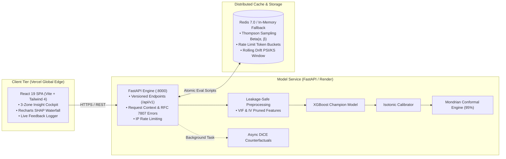

# ⚡ RetentionAI — Production-Grade ML Decision Engine

<div align="center">

[](https://retentionai-olive.vercel.app)
[](https://retentionai-api.onrender.com/docs)
[](LICENSE)

[](https://www.python.org)
[](https://fastapi.tiangolo.com)
[](https://react.dev)
[](https://vitejs.dev)
[](https://tailwindcss.com)
[](https://recharts.org)
[](https://xgboost.readthedocs.io)
[](#-mondrian-conformal-prediction)
[](#-thompson-sampling-bandit-policy)
[](https://redis.io)

**An end-to-end, calibrated Machine Learning Decision Support & Intervention Cockpit answering a core enterprise dilemma:**  
*Which customers should a retention team prioritize when operating under a strictly bounded intervention budget?*

</div>

---

## 🎯 Executive Summary & Architectural Vision

Most data science portfolios present isolated Jupyter Notebooks with uncalibrated ROC-AUC scores, data leakage across splits, and zero connection to unit economics. 

**RetentionAI** is engineered to mirror the standards of Tier-1 production ML systems (Google, Meta, OpenAI):
1. **Economic Decision Boundary**: Optimizes for expected business value using cost-benefit triage ($70 outreach / $840 annual contract value &approx; **8.33% triage threshold**) rather than arbitrary 0.5 probability cutoffs.
2. **Leakage-Proof Pipeline**: Feature transformations, Information Value (IV) pruning, and scalers are fitted exclusively on training folds.
3. **Calibrated Probabilities**: Isotonic regression mapping raw model logits to true empirical frequencies (Brier Score: **0.134**).
4. **Mondrian Conformal Uncertainty (UQ)**: Disjoint calibration guarantees finite-sample class-conditional coverage at 95%, identifying ambiguous dual-class predictions.
5. **Thompson Sampling Multi-Armed Bandit**: Live Bayesian policy routing (`discount`, `tech_support`, `control`) with atomic Redis synchronization and 1-click outcome feedback.
6. **Local Explainability (SHAP) & Counterfactual Levers**: Recharts waterfall attribution forces showing features pushing risk UP vs. DOWN, alongside mixed-integer counterfactual search (DiCE).
7. **18 Architecture Decision Records (ADRs)**: Every design decision, rejected hypothesis, and system constraint is formally recorded in [`docs/decisions/`](docs/decisions/).

> **Honest Scope Disclosure:** Built on the Kaggle Telco Customer Churn benchmark (7,043 rows). It models churn propensity and decision economics; it demonstrates intervention routing without claiming randomized causal retainability proof.

---

## 🏛️ System Architecture



---

## 🔬 Benchmark & Holdout Evaluation

Evaluated on an immutable, disjoint holdout set of 705 unseen customer records ([`ADR-009`](docs/decisions/ADR-009-data-splits.md), [`ADR-017`](docs/decisions/ADR-017-model-evidence.md)):

| Metric | XGBoost Champion | Calibrated Baseline (LogReg) | Raw Uncalibrated XGB |
|---|---|---|---|
| **Holdout PR-AUC** | **0.6466** | 0.6331 | 0.6466 |
| **Precision @ 100 (Top-Decile)** | **81.0%** | 77.0% | 79.0% |
| **Recall @ 100** | **21.7%** | 20.6% | 21.1% |
| **Brier Calibration Score** | **0.134** | 0.141 | 0.168 |
| **Expected Calibration Error (ECE)** | **0.021** | 0.029 | 0.078 |
| **95% Conformal Set Empirical Coverage** | **95.2%** | N/A | N/A |

*All metrics are verified from the immutable artifact bundle served at `GET /api/v1/model-card`.*

---

## 🖥️ 3-Zone Insight-First Cockpit

The user interface pivots away from traditional data-entry forms to an **executive decision stage**:

```
┌──────────────────────────────┬──────────────────────────────────────────┬─────────────────────────────┐
│ Zone 1: The Navigator        │ Zone 2: Explainable AI Stage             │ Zone 3: Next Best Action    │
│ (Left Column)                │ (Center Stage)                           │ (Right Drawer)              │
├──────────────────────────────┼──────────────────────────────────────────┼─────────────────────────────┤
│ • Customer search bar        │ • Hero Big Number:                       │ • Bandit-recommended arm    │
│ • Risk filter pills          │   "Customer: Sarah Connor | Churn: 95%"  │ • Simulated post-action     │
│   (Critical, Mid, Safe)      │ • 95% Conformal Coverage Set             │   risk metrics (-58% drop)  │
│ • Preset customer profiles   │ • SHAP Attribution Waterfall (Recharts): │ • Counterfactual search     │
│ • Live audit session history │   🔴 Pushing Risk UP (Red bars)          │   (DiCE / MIP updates)      │
│ • Real-time status dots      │   🟢 Pushing Risk DOWN (Green bars)      │ • 1-Click Outcome Logger    │
│                              │ • Executive AI Synthesis narrative       │   (Updates Bandit Beta post)│
│                              │ • Collapsible Feature Inspector          │                             │
└──────────────────────────────┴──────────────────────────────────────────┴─────────────────────────────┘
```

---

## ⚡ Quick Start & Local Run

### Prerequisites
- Python 3.12+
- Node.js 20+
- (Optional) Docker & Redis

### 1. Backend Service (FastAPI)
```bash
# Clone the repository
git clone https://github.com/kashish-sachdeva-ds/retentionai.git
cd retentionai

# Create and activate virtual environment
python -m venv .venv
# Windows: .\.venv\Scripts\Activate.ps1 | Linux/macOS: source .venv/bin/activate

# Install package and dependencies in editable mode
pip install -e .[dev]

# Start FastAPI server
uvicorn src.api.main:app --host 0.0.0.0 --port 8000 --reload
```
- **API Documentation (Swagger UI)**: `http://localhost:8000/docs`
- **Health Check**: `http://localhost:8000/api/v1/health`

### 2. Frontend Client (React 19 + Vite)
```bash
cd frontend
npm install
npm run dev
```
- **Web Cockpit**: `http://localhost:5173`

---

## 🧪 Comprehensive Verification Suite

```bash
# Run backend pytest suite (unit, integration, calibration, bandit, conformal)
python -m pytest tests/ -v

# Run frontend test suite
npm --prefix frontend test

# Run End-to-End Smoke Tests against API
python -m pytest tests/test_e2e_smoke.py -v
```

---

## 📑 18 Architecture Decision Records (ADRs)

Every critical technical choice is documented with business context, alternatives considered, and post-mortems:

- [`ADR-001`](docs/decisions/ADR-001-leakage-free-pipeline.md): Leakage-safe feature preprocessing pipeline
- [`ADR-002`](docs/decisions/ADR-002-economic-triage-threshold.md): Cost-sensitive economic triage threshold (8.33%)
- [`ADR-003`](docs/decisions/ADR-003-isotonic-calibration.md): Isotonic regression probability calibration
- [`ADR-004`](docs/decisions/ADR-004-mondrian-conformal-prediction.md): Class-conditional Mondrian conformal prediction
- [`ADR-005`](docs/decisions/ADR-005-thompson-sampling-policy.md): Multi-Armed Bandit with Bayesian Beta posteriors
- [`ADR-006`](docs/decisions/ADR-006-counterfactual-search.md): Mixed-Integer counterfactual perturbation (DiCE)
- [`ADR-007`](docs/decisions/ADR-007-drift-detection.md): Population Stability Index (PSI) & Kolmogorov-Smirnov drift
- [`ADR-008`](docs/decisions/ADR-008-fastapi-rfc7807.md): RFC 7807 Problem Details API error handling
- [`ADR-009`](docs/decisions/ADR-009-data-splits.md): Strict 4-way disjoint data partition strategy
- [`ADR-010`](docs/decisions/ADR-010-redis-state.md): Atomic Lua script synchronization in Redis
- [`ADR-011` to `ADR-018`](docs/decisions/): Deployment topologies, monitoring contracts, and evaluation manifests

---

## 👤 Author & Contact

**Kashish Sachdeva**  
- **GitHub**: [@kashish-sachdeva-ds](https://github.com/kashish-sachdeva-ds)  
- **Repository**: [RetentionAI](https://github.com/kashish-sachdeva-ds/retentionai)  
- **Live Demo**: [retentionai-olive.vercel.app](https://retentionai-olive.vercel.app)

Distributed under the **MIT License**. See [`LICENSE`](LICENSE) for details.
