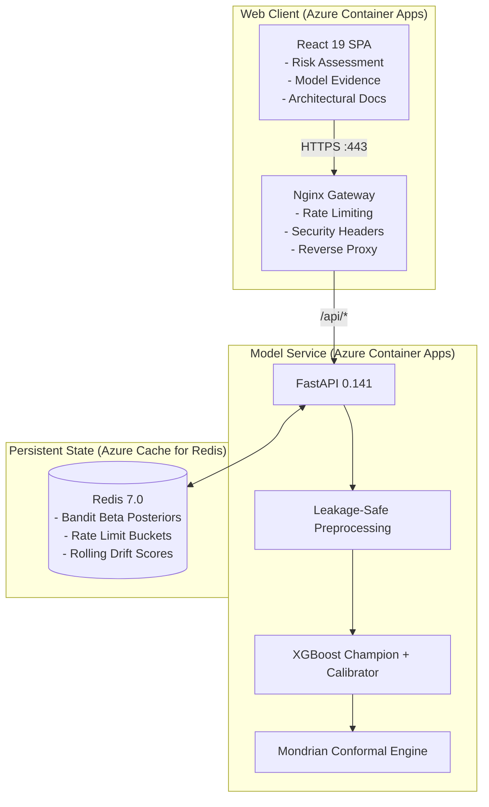

# RetentionAI — Decision-Documented Customer Churn Prioritization

[](https://github.com/kashish-sachdeva-ds/retentionai/actions/workflows/ci-cd.yml)
[](https://fastapi.tiangolo.com)
[](https://react.dev)
[](https://azure.microsoft.com)

A production-hardened machine learning and decision-support engine answering a core telecom business question: **Which customers should a retention team prioritize when operating with a finite call budget?**

Built to demonstrate rigorous, staged ML engineering — featuring a leakage-safe pipeline, isotonic probability calibration, Mondrian conformal uncertainty sets, Thompson Sampling offer routing, and a clean React UI with zero misleading demo data.

> **Portfolio Scope & Honest Limitations:** This is a decision-support demonstration based on the public Kaggle Telco Customer Churn dataset (7,043 rows). It models **churn propensity** and decision economics; it does **not** claim causal treatment effect estimation or randomized retainability proof.

---

## ⚡ Key Highlights & Engineering Pillars

- **Leakage-Safe Tabular Pipeline:** Encoders, IV filters, and scalers fit exclusively on training splits.
- **Calibrated Decision Boundary:** Isotonic regression ensures output scores represent genuine posterior probabilities aligned to the economic triage threshold ($70 outreach / $840 annual revenue &approx; **8.33%**).
- **Mondrian Conformal Uncertainty:** Disjoint calibration and conformal splits provide finite-sample class-conditional prediction set coverage at 95%.
- **Live Thompson Sampling Mechanism:** Dynamic exploration across retention offer arms (`discount`, `technician`, `control`) stored with Redis idempotency.
- **No Mock Data in Public UI:** Every metric, probability, and evidence card is dynamically served by the live FastAPI backend.
- **18 Architecture Decision Records (ADRs):** Comprehensive documentation in `docs/decisions/` explaining *why* decisions were made, including intentional dead-ends and trade-offs.

---

## 🏛️ Architecture Overview



For complete architectural details, see [`docs/ARCHITECTURE.md`](docs/ARCHITECTURE.md).

---

## 📊 Disjoint Holdout Evaluation Benchmark

Held on a separate, unseen 705-row holdout split (`ADR-009`, `ADR-017`):

| Metric | Champion (XGBoost) | Baseline (LogReg) |
|---|---|---|
| **Holdout PR-AUC** | **0.6466** | 0.6331 |
| **Precision @ 100** | **81.0%** | 77.0% |
| **Recall @ 100** | **21.7%** | 20.6% |
| **Brier Score** | **0.134** (calibrated) | 0.141 |
| **95% Conformal Coverage** | **95.2%** | N/A |

*All metrics are verified from the immutable artifact bundle served at `GET /api/model-card`.*

---

## 🚀 Quick Start & Local Run

### Option 1: Docker Compose (Full Stack)

```bash
git clone https://github.com/kashish-sachdeva-ds/retentionai.git
cd retentionai

# Bring up Redis, FastAPI, and React web client
docker compose up --build
```

- **React Web Client:** http://localhost:3000
- **API Swagger Documentation:** http://localhost:8000/docs
- **Health Endpoint:** http://localhost:8000/health

### Option 2: Local Python & Node Development

```bash
# 1. Backend Setup (Python 3.12)
python -m venv .venv
# Windows: .\.venv\Scripts\Activate.ps1 | Linux/macOS: source .venv/bin/activate
pip install -e .[dev]

# 2. Start Redis locally or via Docker
docker run -d -p 6379:6379 redis:7-alpine

# 3. Launch FastAPI backend
uvicorn src.api.main:app --host 0.0.0.0 --port 8000 --reload

# 4. Frontend Setup (Node 22)
cd frontend
npm install
npm run dev
```

---

## 🧪 Testing & Verification

```bash
# Run backend Python tests (API, bandit, conformal, persistence, drift)
python -m pytest tests/ -v

# Run frontend Vitest suite
npm --prefix frontend test

# Run E2E smoke tests against live service
python -m pytest tests/test_e2e_smoke.py -v
```

---

## ☁️ Azure Deployment

To provision and deploy RetentionAI on Azure Container Apps:

```bash
# Set your Azure credentials and deploy
az login
chmod +x infra/provision.sh infra/deploy.sh

# 1. Provision Resource Group, Container Registry, Redis Cache, and Container Apps
./infra/provision.sh

# 2. Subsequent updates
./infra/deploy.sh
```

---

## 📑 Project Structure

```
retentionai/
├── api/                # Production API Dockerfile
├── docs/               # Architecture docs & 18 Architecture Decision Records (ADRs)
│   ├── decisions/      # ADR-000 through ADR-017
│   ├── ARCHITECTURE.md # Detailed system design and diagrams
│   └── SHOWCASE_GUIDE.md # 5-minute senior reviewer walkthrough
├── frontend/           # React 19 + TailwindCSS v4 SPA
│   ├── src/pages/      # Home, Risk Assessment, Model Evidence, About
│   ├── src/components/ # Reusable UI components & customer forms
│   └── src/__tests__/  # Vitest frontend test suites
├── infra/              # Azure provisioning and deployment bash scripts
├── models/             # Versioned serialized artifacts & evaluation manifests
├── nginx/              # Production Nginx reverse-proxy gateway
├── src/                # Core ML pipeline, modeling, conformal, bandit, and API
└── tests/              # Pytest backend and E2E smoke tests
```

---

## 📄 License & Attribution

Distributed under the MIT License. See `LICENSE` for details.
Dataset sourced from Kaggle's [Telco Customer Churn Benchmark](https://www.kaggle.com/datasets/blastchar/telco-customer-churn).
