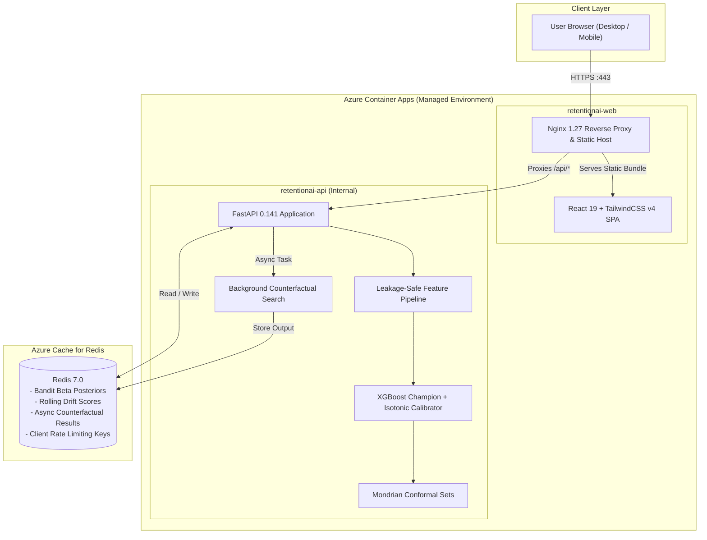
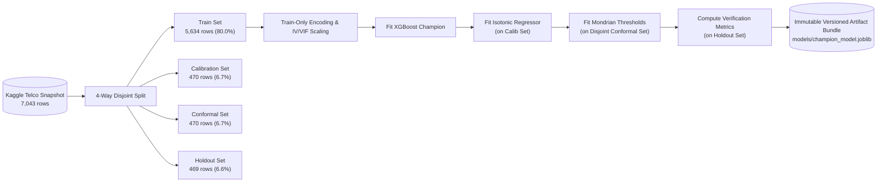
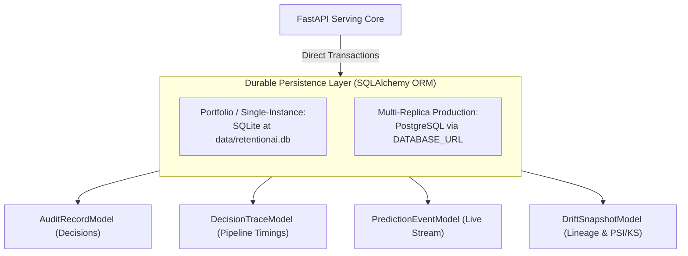

# RetentionAI — Technical Architecture & System Design

RetentionAI is a decision-documented telecom customer churn prediction and retention-offer exploration system. This document outlines the end-to-end data pipeline, serving topology, uncertainty framework, and security boundaries.

---

## 1. System Topology on Azure

---

## 2. ML Engineering Pipeline

---

## 3. Database Persistence & Scaling Strategy

---

## 4. API Endpoints & Access Control

| Endpoint | Method | Access Level | Description |
|---|---|---|---|
| `/health` | `GET` | Public | Service readiness, model loading state, and active version tag. |
| `/model-card` | `GET` | Public | Holdout PR-AUC (with bootstrap CI), Precision@K, calibration Brier/ECE, conformal coverage, and subgroup slices. |
| `/predict` | `POST` | Public (Rate Limited) | Calibrated churn probability, 95% conformal prediction set, assigned bandit arm. |
| `/counterfactual/{request_id}` | `GET` | Public | Asynchronous counterfactual search results for minimum feasible intervention levers. |
| `/bandit/posteriors` | `GET` | Public | Read-only inspection of current Beta distributions across offer arms. |
| `/feedback/{arm_name}` | `POST` | Admin Key Protected | Idempotent retention outcome recording to update Thompson Sampling posteriors. |
| `/monitoring/drift` | `GET` | Public / Admin | PSI & Kolmogorov-Smirnov output score distribution drift checks on live telemetry. |
| `/monitoring/drift/history` | `GET` | Public | Durable historical time-series of point-in-time drift snapshots with data lineage. |
| `/audit/records` | `GET` | Public | Immutable audit log of individual customer assessments and human reviews. |

---

## 5. Key Design Decisions (ADR Reference)

- **ADR-002 (Success Metric):** Evaluated primarily on PR-AUC (not accuracy or ROC-AUC) given class imbalance (~26.5% churn). Cost-sensitive decision threshold derived as $70 / $840 &approx; 8.33%.
- **ADR-007 (Leakage Prevention):** Encoders and scalers are strictly fit on the training split only.
- **ADR-010 & ADR-017 (Disjoint Conformal Calibration):** Separate validation splits are used for isotonic regression vs. Mondrian conformal quantile threshold calculation to preserve finite-sample coverage exchangeability.
- **ADR-012 (Thompson Sampling):** Multi-armed bandit routes offers across `discount`, `technician`, and `control`. Outcomes are stored with SHA-256 idempotency in Redis.
- **ADR-014 (Production Serving):** Pre-trained model artifacts are verified at startup and served via FastAPI.
- **ADR-018 (Durable Storage & Data Lineage):** Dual database strategy (SQLite for single-instance, PostgreSQL for multi-replica) with explicit event ID and window lineage for all drift snapshots.

